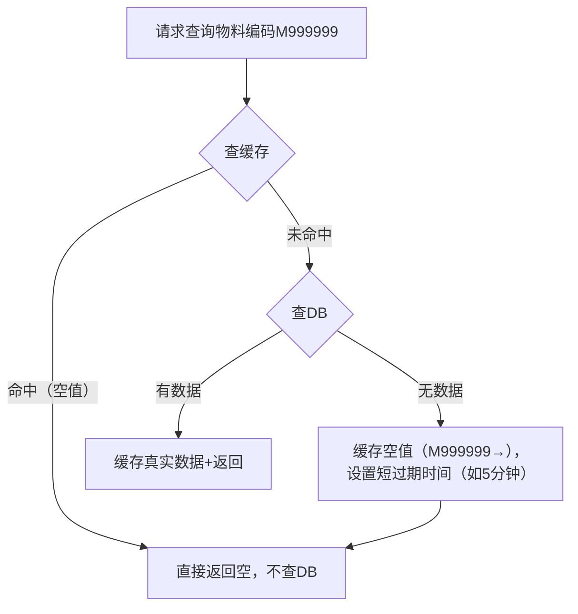
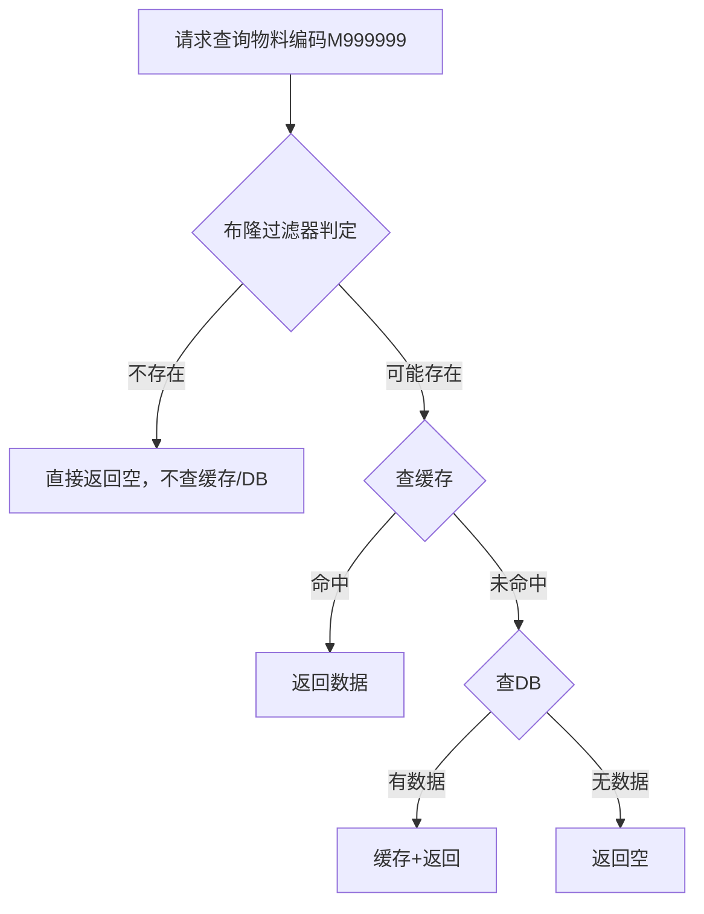

# 基础100题清单 

## C# 语言与面向对象（1–25）

## 1）Nullable

**面试官：**`int?` 是引用类型还是值类型？为什么？  
**候选人（要点）：**`int?` 本质是 `Nullable<int>`，仍然是值类型；内部通常是 `bool HasValue + int Value` 的结构布局。说明它在栈上/堆上取决于“它作为局部变量还是字段/是否被装箱”。

## 2）string 不可变

**面试官：**`string` 明明是引用类型，为什么表现得像值类型？`s = s + "a"` 发生了什么？  
**候选人（要点）：**`string` 不可变，拼接会创建新字符串对象并让 `s` 指向新对象；旧对象等待 GC；频繁拼接会产生大量临时对象，通常用 `StringBuilder` 优化。

## 3）StringBuilder 快在哪里

**面试官：**`StringBuilder` 为什么比 `string` 拼接快？它扩容机制是什么？  
**候选人（要点）：** 内部维护可变缓冲区（数组/块链），追加时尽量原地写入；扩容时按策略增长并复制/链新块，减少“每次拼接都 new 一个新 string”的分配与拷贝次数。

## 4）struct 与接口、装箱

**面试官：**`struct` 能继承类吗？能实现接口吗？实现接口后一定装箱吗？  
**候选人（要点）：**`struct` 不能继承类（隐式继承 `ValueType`），但能实现接口；当以“接口类型/object”引用 struct 时会装箱；在泛型约束/泛型特化某些场景可避免装箱。不会内联。struct 在编译期间就固定大小，类是分配在堆上，动态调整大小

 struct 并没有像类那样 “常规继承”`object`，而是 CLR（公共语言运行时）为所有值类型隐式实现了`object`的核心方法`ToString()`,`GetHashCode()`, `Equals()` 等），并在语义上让值类型 “表现为” 继承自`object`—— 这是一种 “模拟继承”，而非类与类之间的 “真实继承”。  

## 5）栈与堆分布

**面试官：**`MyClass obj = new MyClass()` 里，`obj` 和实例分别在哪里？  
**候选人（要点）：**`obj` 是引用（指针/句柄）通常在栈上（局部变量）；对象实例在托管堆；若是字段则引用也在堆上（随宿主对象）。

## 6）ref/out 与 ref returns

**面试官：**`ref` 和 `out` 本质区别是什么？`ref returns/ref locals` 解决什么问题？  
**候选人（要点）：**`ref` 要求入参先初始化，`out` 要求方法内赋值；它们都是传引用语义。`ref returns` 可避免大结构拷贝/可直接修改内部存储（但要非常小心生命周期与逃逸）。

## 7）const vs readonly

**面试官：**`const` 和 `readonly` 的区别？为什么说 `const` 有版本风险？  
**候选人（要点）：**`const` 编译期常量会被“内联”到调用方程序集；库升级后 const 值变了，调用方若不重新编译仍用旧值。`readonly` 是运行期赋值（构造器/初始化器）

## 8）var vs dynamic

**面试官：**`var` 是弱类型吗？它和 `dynamic` 最大区别？  
**候选人（要点）：**`var` 是编译期类型推断，仍是强类型；`dynamic` 在运行期绑定成员调用，绕过编译期类型检查，错误更晚暴露且性能更差。

## 9）装箱/拆箱与隐式装箱

**面试官：** 什么是装箱拆箱？怎么判断“隐式装箱”发生了？  
**候选人（要点）：** 值类型转 `object`/接口会装箱；拆箱是从对象取回值类型副本。常见隐式装箱：非泛型集合、`string.Format`、接口调用 struct、LINQ 某些非泛型路径等；可用性能分析器/IL/Benchmark 验证。

## 10）Array vs ArrayList💚♐

**面试官：** 数组和 `ArrayList` 区别？为什么不推荐 `ArrayList`？  
**候选人（要点）：** 数组强类型且性能好；`ArrayList` 存 `object` 导致值类型装箱、类型不安全、运行期错误风险高；应使用 `List<T>`。

## 11）接口静态成员与默认实现

**面试官：** 接口能有静态成员吗？接口默认实现有什么价值与风险？  
**候选人（要点）：** 新版 C# 支持接口静态成员与默认实现；价值是为接口演进提供兼容（减少破坏性变更）；风险是实现类可能“无感”继承行为，导致语义不明确或多继承冲突处理更复杂。

## 12）抽象类 vs 接口

**面试官：** 抽象类和接口如何选？从“字段/构造函数/版本演进”角度讲。  
**候选人（要点）：** 

抽象类可持有状态（字段）与构造器，适合共享实现与模板；

接口更偏契约、多实现，利于解耦与扩展；

版本演进上接口默认实现降低破坏性，但抽象类仍更适合共享基础设施代码。

## 13）virtual 与构造器调用虚方法

**面试官：**`virtual` 有什么用？构造器里调用虚方法有什么坑？  
**候选人（要点）：**`virtual` 支持运行期多态；构造器阶段子类尚未初始化完全，虚方法可能执行到子类 override，访问未初始化字段导致异常或逻辑错误（典型“this 逃逸”问题）。

## 14）sealed 的意义

**面试官：**`sealed` 能修饰什么？除了禁止继承还有什么价值？  
**候选人（要点）：** 可修饰类或 override 方法；禁止继承/重写让行为更可控；JIT 可能做去虚拟化（devirtualization）优化，提升性能；也能减少错误扩展点。

## 15）new 隐藏 vs override 重写

**面试官：**`new` 隐藏和 `override` 重写差别？运行时分派有什么不同？  
**候选人（要点）：**`override` 参与虚分派，基类引用调用也会走子类实现；`new` 是编译期按变量静态类型绑定：用基类引用调用会走基类版本，用子类引用调用走子类版本。

## 16）扩展方法本质

**面试官：** 扩展方法到底是什么？能访问 private 吗？  
**候选人（要点）：** 本质是静态方法的语法糖，编译期把 `obj.Ext()` 翻译为 `Ext(obj)`；不能访问 private（除非同程序集内部配合特殊手段，但常规不行）。

## 17）委托 vs 事件

**面试官：**`delegate` 和 `event` 差在哪？为什么事件更安全？  
**候选人（要点）：** 委托是可被外部赋值/调用的函数引用；事件是对委托的封装，只允许订阅/取消订阅，禁止外部直接触发或置空（防止“外部乱 invoke/乱清理订阅者”）。

## 18）静态构造函数

**面试官：** 静态构造函数什么时候执行？能有参数吗？抛异常会怎样？  
**候选人（要点）：** 首次访问类型（静态成员/创建实例）前执行一次；不能有参数；若抛异常，类型初始化失败，后续再使用该类型通常持续失败（TypeInitializationException 等），属于严重问题。

## 19）this 在构造链与索引器

**面试官：**`this()` 构造链用来解决什么？索引器里的 `this[]` 本质是什么？  
**候选人（要点）：**`this()` 复用初始化逻辑，减少重复；索引器本质是属性（`get_Item/set_Item`），只是语法上像数组访问。

## 20）Finalizer 与 Dispose

**面试官：** 析构函数（Finalizer）什么时候执行？和 `Dispose()` 的关系？  
**候选人（要点）：** Finalizer 由 GC 在不确定时间调用，用于兜底释放非托管资源；`Dispose` 是确定性释放，推荐模式是 `Dispose` 释放资源并 `GC.SuppressFinalize(this)` 防止重复清理与增加 GC 负担。

## 21）C# 泛型 vs Java 泛型

**面试官：** C# 泛型和 Java 泛型最大的底层差异？  
**候选人（要点）：** C# 是“真泛型”（运行时保留类型参数信息，JIT 可对值类型做特化）；Java 多为类型擦除（运行时泛型信息弱），因此一些反射/性能/类型安全特性不同。

## 22）IEnumerable 延迟执行

**面试官：** 什么叫 LINQ 延迟执行？怎么判断什么时候真的执行了？  
**候选人（要点）：** 查询表达式只是构建迭代器/表达式树，直到枚举（foreach）、`ToList/ToArray/Count/Any` 等终结操作才执行；延迟执行易导致“多次枚举、多次访问数据库/IO”的坑。

## 23）List Capacity 与扩容

**面试官：**`List<T>` 的 `Count` 和 `Capacity` 区别？扩容发生什么？  
**候选人（要点）：**`Count` 是实际元素个数，`Capacity` 是内部数组长度；扩容会分配新数组并复制旧元素（O(n)），频繁扩容会抖动，初始化可预估容量。

## 24）Dictionary 冲突处理

**面试官：**`Dictionary<K,V>` 怎么处理哈希冲突？为什么 key 的 `GetHashCode` 很关键？  
**候选人（要点）：** 通常是桶数组 + 链/探测等策略；冲突多会退化并影响性能；必须保证 `Equals` 与 `GetHashCode` 一致性，否则出现“找不到 key/重复 key”等隐蔽 bug。

## 25）泛型约束

**面试官：**`where T : struct`、`where T : new()` 各解决什么问题？能同时用吗？  
**候选人（要点）：**`struct` 保证值类型（可避免 null、便于特化）；`new()` 保证可无参构造。`struct` 自带无参构造语义但语法约束组合有规则，重点说清“约束用于编译期保证可用成员与构造方式”。

<hr/>

## ASP.NET Core 基础（26–40）

## 26）Host/Builder 默认做了什么

**面试官：**`CreateBuilder(args)` 默认帮你做了哪些事？为什么不建议自己全手写？  
**候选人（要点）：** 默认加载配置源（json、环境变量、命令行等）、配置日志、Kestrel、DI 容器与基础服务；手写容易漏掉环境配置、日志、编码与默认行为，导致环境差异 bug。

## 27）ConfigureServices vs Configure（旧模型理解）

**面试官：** 老的 `Startup` 里 `ConfigureServices` 和 `Configure` 各负责什么？映射到现在 minimal hosting 怎么理解？  
**候选人（要点）：** 前者注册依赖与配置选项；后者搭建中间件管道。Minimal hosting 把两者合并在 Program.cs，但概念仍然是“先注册、再组装 pipeline”。

## 28）中间件顺序

**面试官：** 中间件执行顺序为什么这么重要？`UseRouting` 和 `UseEndpoints` 中间一般放什么？  
**候选人（要点）：** 顺序决定请求能否到达端点、鉴权是否生效。通常 `UseRouting` 后放认证/授权（`UseAuthentication/UseAuthorization`），再 `UseEndpoints` 映射控制器。

## 29）Use/Run/Map

**面试官：**`Use`、`Run`、`Map` 区别？哪个会短路？  
**候选人（要点）：**`Use` 可调用 next 形成链；`Run` 终结管道（短路）；`Map` 基于路径分支管道（比如 `/health` 走独立分支）。

## 30）Kestrel 与 IIS

**面试官：** Kestrel 是什么？IIS 和 Kestrel 在生产里一般怎么搭配？  
**候选人（要点）：** Kestrel 是跨平台 Web Server；Windows 上可由 IIS 做反向代理到 Kestrel（提供进程管理、证书、端口绑定等）；Linux 常用 Nginx/Apache 反代到 Kestrel。

## 31）管道构建机制

**面试官：** 管道到底怎么“串起来”的？你能用一句话解释 `next` 是什么吗？  
**候选人（要点）：** 每个中间件接收 `HttpContext` 并持有一个 `RequestDelegate next`；调用 next 就把控制权交给下一个中间件，形成委托链（洋葱模型）。

## 32）配置与 Options

**面试官：**`IConfiguration` 怎么来的？`IOptions<T>`、`IOptionsSnapshot<T>`、`IOptionsMonitor<T>` 怎么选？  
**候选人（要点）：** 配置来自多源聚合；`IOptions` 适合单例读、`Snapshot` 适合每请求刷新（Scoped）、`Monitor` 支持变更通知与热更新（常用于动态配置）。

## 33）IOC 与 DI

**面试官：** IOC 和 DI 区别？为什么 DI 能提升可测试性？  
**候选人（要点）：** IOC 是控制权反转思想，DI 是实现方式之一；把依赖交给外部容器构建，使得单元测试中可替换依赖（Mock/Fake），隔离外部系统（DB、MQ、HTTP）。

## 34）三种生命周期

**面试官：** Transient/Scoped/Singleton 分别适用什么场景？说错一个我就认为你线上会出事故。  
**候选人（要点）：** Transient：轻量无状态；Scoped：请求级（DbContext/Repository/UserContext）；Singleton：全局共享且线程安全（配置、缓存客户端、连接工厂等）。

## 35）Controller 生命周期

**面试官：** Controller 默认什么生命周期？为什么？  
**候选人（要点）：** 通常按请求创建（可理解为 Scoped/Transient 语义），保证每次请求拿到干净的上下文，避免并发共享状态；关键是不要在 Controller 存跨请求状态。

## 36）Singleton 捕获 Scoped

**面试官：** 你在 Singleton 里注入了 DbContext 会怎样？这个问题叫什么？  
**候选人（要点）：** Captive Dependency（被捕获依赖）；DbContext 不是线程安全的且应随请求释放，被单例长期持有会导致并发问题、内存增长、连接泄漏等；解决：改生命周期或用 `IServiceScopeFactory` 在方法内创建 scope。

## 37）IServiceProvider 与 ScopeFactory

**面试官：** 什么时候需要 `IServiceScopeFactory`？你怎么用它正确拿到 Scoped 服务？  
**候选人（要点）：** 在 Singleton/后台任务中需要 Scoped 服务时使用；通过 `CreateScope()` 获取 `scope.ServiceProvider` 再 `GetRequiredService<T>()`，并确保 scope 正确 Dispose。

## 38）注入方式

**面试官：** 构造器注入、属性注入、方法注入各有什么问题？.NET 内置容器偏好哪种？  
**候选人（要点）：** 构造器注入最推荐（依赖显式、易测试）；属性注入隐藏依赖且易空；方法注入适合少量临时依赖。内置容器默认走构造器注入。

## 39）[ApiController]

**面试官：**`[ApiController]` 到底帮你做了什么？为什么有时候加了它会“莫名其妙 400”？  
**候选人（要点）：** 自动推断参数来源、自动模型验证；模型验证失败会自动返回 400（如果未自定义行为），所以看似“没进 action 就 400”，其实是框架拦截了。

## 40）FromQuery/FromBody 等

**面试官：**`[FromQuery]`、`[FromBody]`、`[FromRoute]`、`[FromForm]` 什么时候用？你举一个常见用错导致线上 bug 的例子。  
**候选人（要点）：** Query 用筛选分页；Body 用 JSON 复杂对象；Route 用资源标识；Form 用 multipart 上传。常见错：GET 误用 FromBody 导致绑定失败；或复杂对象没标注导致推断错误，前端传了但后端参数全是默认值。

## 数据库与 EF Core（41–70）[ziprecruiter](https://www.ziprecruiter.com/Salaries/Senior-Net-Developer-Salary)

## 41）字符类型与中文

**面试官：**`CHAR`、`VARCHAR`、`NVARCHAR` 有什么区别？你在 SQL Server 里存中文一般选哪个？为什么？  
**候选人（要点）：**`CHAR` 定长，`VARCHAR` 变长（非 Unicode），`NVARCHAR` 变长（Unicode）。中文/多语言场景优先 `NVARCHAR`，避免乱码与字符集转换问题；代价是占用空间更大、索引体积也更大。`CHAR` 适合长度固定且频繁比较的字段（如状态码、固定编码）。[ziprecruiter](https://www.ziprecruiter.com/Salaries/Senior-Net-Developer-Salary)

## 42）datetime vs datetime2

**面试官：**`DATETIME` 和 `DATETIME2` 区别是什么？实际项目里你怎么选？  
**候选人（要点）：**`DATETIME2` 精度更高、范围更大，通常更推荐作为新项目默认类型。时间字段要提前统一时区策略（UTC or 本地时区）和格式化输出，避免跨系统对接时出现“同一时刻不同显示”的问题。需要审计（created/updated）时，还要确保写入逻辑一致且不可被随意覆盖。[ziprecruiter](https://www.ziprecruiter.com/Salaries/Senior-Net-Developer-Salary)

## 43）delete / truncate

**面试官：**`DELETE` 和 `TRUNCATE` 的区别？线上敢随便用 `TRUNCATE` 吗？  
**候选人（要点）：**`DELETE` 是逐行删除，会记录更多日志，支持 `WHERE` 条件；`TRUNCATE` 是快速清空整表，通常不支持条件并且对约束/引用关系要求更严格。线上一般禁止随意 `TRUNCATE`，需要明确权限控制、操作审计、以及对外键依赖做检查，否则可能引发不可恢复的数据事故。[ziprecruiter](https://www.ziprecruiter.com/Salaries/Senior-Net-Developer-Salary)

## 44）主键 vs 唯一约束

**面试官：** 主键和唯一约束有啥区别？为什么很多表既有主键又有业务唯一键？  
**候选人（要点）：** 主键用于行标识与聚集组织（很多情况下聚集索引建在主键上），唯一约束用于保证业务唯一性（如单据号、外部对接号）。分开设计可以让主键保持稳定（比如使用自增/雪花ID），同时把业务约束交给唯一键，避免业务变化导致主键语义变更。[ziprecruiter](https://www.ziprecruiter.com/Salaries/Senior-Net-Developer-Salary)

## 45）聚集索引与非聚集索引

**面试官：** 聚集索引和非聚集索引到底差在哪？为什么一张表只能有一个聚集索引？  
**候选人（要点）：** 聚集索引决定数据行的物理（或逻辑）组织顺序，叶子节点就是数据页本身；非聚集索引叶子节点保存键值 + 指向数据行的定位信息（通常是聚集键）。因为数据行只能按一种顺序组织，所以聚集索引只能有一个。选聚集键要考虑：递增性、热点、分页与范围查询场景。[ziprecruiter](https://www.ziprecruiter.com/Salaries/Senior-Net-Developer-Salary)

## 46）SQL 注入与参数化

**面试官：** 什么是 SQL 注入？参数化查询为什么能防？ORM 就一定安全么？  
**候选人（要点）：** SQL 注入是把用户输入拼接进 SQL 导致语义被篡改（例如注入 `OR 1=1`）。参数化把“输入”作为参数传递，数据库按值处理而不是按 SQL 片段解析。ORM 默认多数场景会参数化，但只要用了字符串拼接的原生 SQL（`FromSqlRaw` 拼接）仍然会中招，所以安全边界在“是否拼接 SQL”。[ziprecruiter](https://www.ziprecruiter.com/Salaries/Senior-Net-Developer-Salary)

## 47）JOIN 全家桶

**面试官：**`INNER JOIN`、`LEFT JOIN`、`FULL JOIN`、`CROSS JOIN` 区别？给你一个例子：为什么报表更常用 LEFT JOIN？  
**候选人（要点）：**`INNER` 只保留两边都有匹配的行，`LEFT` 保留左表所有行并用 NULL 填充右表缺失，`FULL` 两边都保留，`CROSS` 是笛卡尔积。报表常用 `LEFT JOIN` 是为了“不丢维度”：即使没有明细/流水，也要展示主数据（例如某物料当月无出入库也要展示为 0）。`CROSS JOIN` 一般只在生成维度组合或特殊分析时谨慎使用。[ziprecruiter](https://www.ziprecruiter.com/Salaries/Senior-Net-Developer-Salary)

## 48）GROUP BY / HAVING / WHERE

**面试官：**`WHERE` 和 `HAVING` 区别？为什么说 `HAVING` 慢？  
**候选人（要点）：**`WHERE` 在聚合前过滤行，`HAVING` 在 `GROUP BY` 聚合后过滤分组结果。`HAVING` 往往意味着先做聚合才能过滤，代价更高；能用 `WHERE` 提前缩小数据集就不要用 `HAVING`。优化思路是把条件尽量下推到 `WHERE`，减少参与聚合的数据量。[ziprecruiter](https://www.ziprecruiter.com/Salaries/Senior-Net-Developer-Salary)

## 49）ACID

**面试官：** ACID 说一遍，并举一个 ERP 场景解释“隔离性”为什么重要。  
**候选人（要点）：** 原子性、一致性、隔离性、持久性。隔离性在库存扣减/审核场景很关键：两个并发事务如果读取到彼此未提交或中间状态，会导致超卖、重复审核、金额被覆盖等错误。实际工程里还要在一致性和性能之间做平衡，选择合适的隔离级别与并发控制方案。[ziprecruiter](https://www.ziprecruiter.com/Salaries/Senior-Net-Developer-Salary)

## 50）范式与反范式

**面试官：** 你说一下三大范式。那为什么很多 ERP 报表表又反范式？  
**候选人（要点）：** 范式的目标是减少冗余、避免更新异常；但报表查询往往是读多写少，对性能要求高，因此会反范式（冗余字段/预聚合表/宽表）来减少 join 和聚合成本。关键是：反范式数据要有一致性维护机制（触发器、任务、事件驱动），并明确“真源数据”在哪里。[ziprecruiter](https://www.ziprecruiter.com/Salaries/Senior-Net-Developer-Salary)

## 51）Code First vs DB First

**面试官：** EF Core 的 Code First 与 DB First 怎么选？团队协作时怎么避免“库漂移”？  
**候选人（要点）：** Code First 强在代码驱动、可重构、配合迁移；DB First 强在已有库、强 DBA 管控场景。协作时要以 Migration 或 DDL 脚本为唯一变更来源，并把变更纳入 CI/CD；禁止本地随手改库不提交脚本，否则会出现环境不一致。[ziprecruiter](https://www.ziprecruiter.com/Salaries/Senior-Net-Developer-Salary)

## 52）DbContext 线程安全

**面试官：**`DbContext` 为啥不是线程安全的？你在并发场景怎么用它？  
**候选人（要点）：**`DbContext` 维护变更跟踪器、缓存与状态机，多个线程并发修改会导致状态竞争与不一致。正确方式是每个请求/每个工作单元使用独立 `DbContext`，并避免在并发任务里共享同一个 context；需要并行就创建多个 scope/context，或把并行逻辑下沉为数据库批处理。[ziprecruiter](https://www.ziprecruiter.com/Salaries/Senior-Net-Developer-Salary)

## 53）DbSet 与 IQueryable

**面试官：**`DbSet<T>` 和 `IQueryable<T>` 的关系是什么？为什么说“不要随便返回 IQueryable”？  
**候选人（要点）：**`DbSet<T>` 实现了 `IQueryable<T>`，它只是查询入口，真正执行由 provider 翻译成 SQL。返回 `IQueryable` 会把“执行权”交给调用方，可能导致未受控的过滤/排序/枚举次数、甚至在 context 释放后才执行引发异常；正确做法是服务层完成查询边界（过滤、分页、投影）并返回 DTO/列表。[ziprecruiter](https://www.ziprecruiter.com/Salaries/Senior-Net-Developer-Salary)

## 54）导航属性

**面试官：** 导航属性是干嘛的？一对多、多对多怎么映射？  
**候选人（要点）：** 导航属性表达实体间关系，EF Core 用它构建模型与生成 JOIN。1:N 通常是主表集合 + 从表外键，N:N 可用隐式联结表或显式联结实体；显式联结实体适合需要在联结上挂字段（如数量、时间、状态）。映射时要明确外键、级联行为与删除策略，避免误删连锁事故。[ziprecruiter](https://www.ziprecruiter.com/Salaries/Senior-Net-Developer-Salary)

## 55）Lazy / Eager / Explicit

**面试官：** 延迟加载、贪婪加载、显式加载区别？延迟加载为什么常被说“坑”？  
**候选人（要点）：** 贪婪加载用 `Include` 一次把关系数据取回；显式加载是拿到实体后再手动 `Load`；延迟加载是在访问导航属性时自动发起查询。延迟加载坑在：不经意触发 N+1、隐式多次查库、性能难预测；在 API 场景还容易序列化时触发额外查询导致不可控负载。[ziprecruiter](https://www.ziprecruiter.com/Salaries/Senior-Net-Developer-Salary)

## 56）Include/ThenInclude

**面试官：**`Include` 会生成怎样的 SQL？什么时候会出现“数据膨胀”？  
**候选人（要点）：** 多个集合 `Include` 往往生成大 JOIN，导致结果集行数按组合倍增（看起来像“重复数据”），网络传输与内存占用上升。解决思路包括：投影到 DTO、拆分查询、减少 include 层级、按需加载。核心原则是“不要为方便而一次把整棵对象树拉回来”。[ziprecruiter](https://www.ziprecruiter.com/Salaries/Senior-Net-Developer-Salary)

## 57）Change Tracking

**面试官：** EF Core 的变更跟踪在做什么？什么时候必须 `AsNoTracking()`？  
**候选人（要点）：** 变更跟踪记录实体快照与状态（Added/Modified/Deleted），用于生成更新语句。只读查询应使用 `AsNoTracking` 降低内存与 CPU 成本，特别是列表页/报表页；否则大量实体进入跟踪器可能导致内存增长与性能下降。需要更新时再显式 attach 或使用跟踪查询。[ziprecruiter](https://www.ziprecruiter.com/Salaries/Senior-Net-Developer-Salary)

## 58）FromSqlRaw / ExecuteSqlRaw

**面试官：** 为什么 `FromSqlRaw` 容易出安全问题？`FromSqlInterpolated` 又是什么？  
**候选人（要点）：**`FromSqlRaw` 如果用字符串拼接把用户输入写进 SQL，会引入注入风险；应使用参数化或插值安全 API（插值会参数化）。此外还要注意：原生 SQL 的可移植性差、与模型映射一致性要验证、并且要防止返回列不匹配导致运行时异常。[ziprecruiter](https://www.ziprecruiter.com/Salaries/Senior-Net-Developer-Salary)

## 59）SaveChanges 是否默认事务

**面试官：**`SaveChanges()` 是否默认开启事务？多次 `SaveChanges` 有什么风险？  
**候选人（要点）：** 一次 `SaveChanges` 会把当前上下文的变更作为一个提交单元（通常会在需要时使用事务语义）。如果把一个业务操作拆成多次 `SaveChanges`，中途失败会留下部分提交的数据，破坏业务一致性；应显式使用事务把多步写入包起来，或者采用工作单元模式统一提交。[ziprecruiter](https://www.ziprecruiter.com/Salaries/Senior-Net-Developer-Salary)

## 60）影子属性

**面试官：** 什么是影子属性？你会拿它做什么？  
**候选人（要点）：** 影子属性是模型里有、实体类里没有的字段（例如 `TenantId`、`CreatedTime`），通过 Fluent API 配置。它适合统一审计字段或多租户字段而不污染领域模型，但也会降低直观性；团队需要约定读写方式（例如在 SaveChanges 拦截器里统一填充）。[ziprecruiter](https://www.ziprecruiter.com/Salaries/Senior-Net-Developer-Salary)

## 61）Fluent API 基础

**面试官：**`HasKey/HasIndex/HasMaxLength/IsRequired` 这些配置，分别解决什么问题？  
**候选人（要点）：**`HasKey` 定义主键，`HasIndex` 定义索引（配合唯一索引做幂等/去重），`HasMaxLength` 影响列类型与索引长度，`IsRequired` 影响 NULL 约束与模型验证。面试里更看重你能说清“这些不是装饰品”，而是会影响数据一致性、性能、以及错误暴露位置（早发现）。[ziprecruiter](https://www.ziprecruiter.com/Salaries/Senior-Net-Developer-Salary)

## 62）Migration 的边界

**面试官：** 迁移是做什么的？为什么线上迁移要谨慎？  
**候选人（要点）：** Migration 把模型变更变成可版本化、可回放的脚本。线上迁移要谨慎因为可能锁表、耗时、失败回滚复杂，尤其是加列默认值、重建索引、数据回填等操作；通常要做灰度、低峰、可回滚策略与演练。团队要约定迁移规范（一次迁移只做小步）。[ziprecruiter](https://www.ziprecruiter.com/Salaries/Senior-Net-Developer-Salary)

## 63）乐观并发 RowVersion

**面试官：** 乐观并发怎么做？EF Core 冲突时会发生什么？  
**候选人（要点）：** 用 `RowVersion/Timestamp` 作为并发令牌，更新时带上旧版本号到 `WHERE` 条件。若受影响行数为 0，EF Core 会认为发生并发冲突并抛异常；处理策略是提示用户刷新或进行重试合并（后台任务可有限重试）。核心目标是避免“后保存的人覆盖先保存的人”。[ziprecruiter](https://www.ziprecruiter.com/Salaries/Senior-Net-Developer-Salary)

## 64）客户端评估

**面试官：** 什么叫客户端评估？为什么 EF Core 后来更严格？  
**候选人（要点）：** 客户端评估是指 LINQ 里数据库无法翻译的部分被拉到内存执行，可能导致全表拉取与灾难性性能问题。更严格的策略是宁愿抛异常也不悄悄把 SQL 变成“把全库搬回应用服务器”，这能强迫开发者在开发阶段就修正查询表达式。[ziprecruiter](https://www.ziprecruiter.com/Salaries/Senior-Net-Developer-Salary)

## 65）全局查询过滤器

**面试官：** 全局查询过滤器能解决什么？它有什么坑？  
**候选人（要点）：** 常用于软删除、多租户、数据权限等“默认过滤”。坑在：某些后台管理/审计需要忽略过滤器时要显式关闭（比如管理员查看已删除数据），以及 join/子查询时可能引入难以察觉的过滤条件，导致“查不到数据”的排查成本上升。要配合清晰的约定与可观测性（日志打印最终 SQL）。[ziprecruiter](https://www.ziprecruiter.com/Salaries/Senior-Net-Developer-Salary)

## 66）分页基础

**面试官：** 你怎么做分页？为什么大页数 `Skip/Take` 会慢？  
**候选人（要点）：** 常用 `OrderBy + Skip + Take`，必须有稳定排序字段，否则分页结果不稳定。大页数慢是因为 `Skip` 本质上要扫描/跳过大量行；更稳的方式是基于游标/最后一条记录的 keyset pagination（按主键/时间戳继续翻页）。报表类需求则应考虑预聚合与索引支持。[ziprecruiter](https://www.ziprecruiter.com/Salaries/Senior-Net-Developer-Salary)

## 67）N+1 问题（数据库基础版）

**面试官：** 你给我解释 N+1，别只背定义，给一个真实 API 的例子。  
**候选人（要点）：** 典型是“先查订单列表 1 次，再对每个订单查明细 N 次”，导致总查询次数 N+1。修复手段：用 `Include`、一次性批量查询后在内存 join、或者投影到 DTO 直接用 join 返回扁平结果。关键是用日志/Profiler 发现“同一个接口瞬间打了几十上百条 SQL”。[ziprecruiter](https://www.ziprecruiter.com/Salaries/Senior-Net-Developer-Salary)

## 68）事务边界（EF Core 基础版）

**面试官：** 什么时候你必须显式开事务？给一个 ERP 场景。  
**候选人（要点）：** 一个业务动作涉及多表写入且必须原子（如“审核入库单：写入库单状态、写库存流水、更新库存数量、写审计日志”）。必须用一个事务保证要么全部成功要么全部失败；同时要控制事务时间短，避免长事务锁住资源造成阻塞。出现异常要能回滚并给出可理解的错误信息。[ziprecruiter](https://www.ziprecruiter.com/Salaries/Senior-Net-Developer-Salary)

## 69）唯一索引做幂等（基础版）

**面试官：** API 重试导致重复下单怎么办？基础方案怎么做？  
**候选人（要点）：** 最基础、最可靠的方法是建立业务唯一键（例如 `ExternalRequestId`/单据号）并加唯一索引。接口先插入，重复就会被唯一索引拦截；应用捕获唯一键冲突并返回“已处理/已存在”的幂等响应。比“先查再插”更安全，因为并发下先查再插仍会竞态。[ziprecruiter](https://www.ziprecruiter.com/Salaries/Senior-Net-Developer-Salary)

## 70）日志与 SQL 可观测性（基础版）

**面试官：** 你怎么在开发/线上看到 EF Core 实际执行的 SQL？为什么这很关键？  
**候选人（要点）：** 通过日志系统输出 EF Core SQL（含参数、耗时），或者在开发阶段使用 Profiler/拦截器记录。关键在于：很多性能/一致性问题本质是“你以为执行了 1 条 SQL，但实际执行了 100 条”，没有可观测性就无法定位。还要注意线上日志脱敏（防止泄露敏感数据）。[ziprecruiter](https://www.ziprecruiter.com/Salaries/Senior-Net-Developer-Salary)

<hr/>

## 设计模式与 SOLID（71–80）[ziprecruiter](https://www.ziprecruiter.com/Salaries/Senior-Net-Developer-Salary)

## 71）SOLID 总览

**面试官：** SOLID 五大原则你别背英文缩写，讲“各自解决什么痛点”。  
**候选人（要点）：** SRP 防止类变成上帝对象；OCP 让新增需求主要通过扩展而非修改旧代码；LSP 保证多态替换正确性；ISP 防止胖接口拖累实现；DIP 让高层依赖抽象、便于替换与测试。能结合项目例子（如多支付方式、多税率规则）更加分。[ziprecruiter](https://www.ziprecruiter.com/Salaries/Senior-Net-Developer-Salary)

## 72）SRP（单一职责）

**面试官：** 给你一个 `OrderService` 里同时有“算价格、写库、发MQ、写日志、调库存”，你怎么看？  
**候选人（要点）：** 这是 SRP 典型违例，类会因多个原因变化。拆法是把业务规则下沉到领域/策略，把基础设施（持久化、消息、日志）通过接口抽象注入，并在应用服务层做编排，既保持一致性又可测试。拆分后每个组件的边界清晰，定位问题也更快。[ziprecruiter](https://www.ziprecruiter.com/Salaries/Senior-Net-Developer-Salary)

## 73）OCP（开闭原则）

**面试官：** 税率规则新增一种“按地区+品类”组合计算，你怎么做到不改旧代码？  
**候选人（要点）：** 用策略模式：定义 `ITaxStrategy`，不同规则实现不同策略；用工厂/注册表按上下文选择策略。新增规则只新增类与配置，不修改既有计算核心；单元测试覆盖每种策略，防止回归。[ziprecruiter](https://www.ziprecruiter.com/Salaries/Senior-Net-Developer-Salary)

## 74）DIP 与 DI 的关系

**面试官：** 依赖倒置和依赖注入是一回事吗？  
**候选人（要点）：** DIP 是设计原则（依赖抽象），DI 是实现手段（由容器/外部提供依赖）。可以不用 DI 容器也能遵守 DIP（手动 new 组合），但容器能降低装配成本并提升一致性。反过来，只用 DI 容器但依赖具体实现（不抽象）也不算遵守 DIP。[ziprecruiter](https://www.ziprecruiter.com/Salaries/Senior-Net-Developer-Salary)

## 75）ISP（接口隔离）

**面试官：** 为什么“大而全接口”是灾难？给一个你见过的例子。  
**候选人（要点）：** 胖接口迫使实现类实现不需要的方法，导致空实现、异常抛出或条件分支爆炸。更糟的是接口变更会牵连大量实现与调用方，版本演进痛苦。合理做法是按使用方拆接口（读/写分离、查询/命令分离）。[ziprecruiter](https://www.ziprecruiter.com/Salaries/Senior-Net-Developer-Salary)

## 76）LSP（里氏替换）

**面试官：** 你怎么判断一个继承设计违反了里氏替换？  
**候选人（要点）：** 只要“父类能工作的地方，子类替换后行为变坏/抛新异常/破坏约束”，就是 LSP 问题。典型信号是子类需要重写父类方法并削弱前置条件或加强后置条件，或者出现大量 `if (obj is SubType)` 的类型判断。很多时候应改为组合而非继承。[ziprecruiter](https://www.ziprecruiter.com/Salaries/Senior-Net-Developer-Salary)

## 77）Singleton（单例）基础版

**面试官：** 单例为什么经常被骂？它的问题在哪？  
**候选人（要点）：** 单例容易引入全局状态与隐式依赖，导致难测试、难并发控制、生命周期不可控。线程安全与初始化顺序也容易出坑。更好的替代通常是：把共享依赖注册为 DI 的 Singleton，并尽量保持无状态或内部线程安全。[ziprecruiter](https://www.ziprecruiter.com/Salaries/Senior-Net-Developer-Salary)

## 78）工厂模式基础版

**面试官：** 什么时候你需要工厂，而不是在代码里直接 `new`？  
**候选人（要点）：** 当创建逻辑复杂（需要根据配置/环境选择实现、需要缓存实例、需要延迟创建）时用工厂。工厂把创建与使用解耦，配合 DI 可以把选择逻辑集中管理。也能避免业务代码里出现一堆 `switch`/`if` 来决定 new 哪个实现。[ziprecruiter](https://www.ziprecruiter.com/Salaries/Senior-Net-Developer-Salary)

## 79）观察者模式（事件）

**面试官：** C# 里的事件算观察者模式吗？它解决了什么？  
**候选人（要点）：** 是进程内观察者：发布者不需要知道订阅者是谁，只负责广播通知，实现解耦。风险是订阅者未取消订阅可能导致内存泄漏（发布者持有委托引用），所以要有取消订阅或使用弱事件等策略。跨进程就需要消息队列/事件总线，这是后续进阶话题。[ziprecruiter](https://www.ziprecruiter.com/Salaries/Senior-Net-Developer-Salary)

## 80）策略模式（基础版）

**面试官：** 你用一句话说清策略模式，并给一个最朴素的业务例子。  
**候选人（要点）：** 策略模式把“可替换的算法/规则”封装成独立策略，通过统一接口在运行时选择。例子：不同客户的价格折扣规则、不同仓库的拣货规则（FIFO/FEFO）、不同支付渠道手续费计算。核心收益是减少 if-else 链并便于新增规则与测试。[ziprecruiter](https://www.ziprecruiter.com/Salaries/Senior-Net-Developer-Salary)

下面继续 **基础题库（下）81–100：Redis + RabbitMQ**，保持“面试官口吻 + 追问式问答”的真实面试节奏。[ziprecruiter](https://www.ziprecruiter.com/Salaries/Senior-Net-Developer-Salary)

## Redis 基础（81–90）

## 81）Redis 为什么快

**面试官：** Redis 为什么快？别只说“内存”。  
**候选人（要点）：** 核心是内存读写 + 高效数据结构 + 事件驱动模型减少线程切换开销；同时命令执行路径短、协议简单。  
**面试官追问：** “单线程”是不是意味着不能用多核？你怎么解释 Redis 在多核机器上依然能抗很高 QPS？

## 82）五种数据类型怎么选

**面试官：** String / Hash / List / Set / ZSet，你用一个 ERP 场景分别举例怎么选。  
**候选人（要点）：**

+ String：缓存某个物料基础信息的 JSON 或版本号。
+ Hash：缓存订单/物料对象的字段（便于局部更新）。
+ List：简单队列/日志流水（注意可靠性与阻塞）。
+ Set：去重（如“今日已处理单据ID集合”）。
+ ZSet：排行榜/按时间排序的任务（score=时间戳）。  
  **面试官追问：** Hash 和 String(JSON) 你怎么权衡？字段更新频繁时哪个更合适？

## 83）过期策略与 TTL

**面试官：** TTL 是什么？你怎么设计缓存的过期时间，避免“一刀切 30 分钟”？  
**候选人（要点）：** TTL 是 key 的生存时间；过期时间要结合数据变化频率与业务容忍度，并对热点 key 做随机过期（抖动）避免同一时刻集体失效。  
**面试官追问：** 哪些数据不适合设置 TTL（比如权限/字典/配置）？不设 TTL 又怎么保证一致性？

## 84）缓存穿透

**面试官：** 什么是缓存穿透？给一个“查不存在物料编码”的例子。  
**候选人（要点）：** 大量请求查询数据库不存在的数据，缓存没命中就一直打到 DB。  
**面试官追问：** 你怎么治理？“缓存空值”和“布隆过滤器”各自的优缺点是什么？什么情况下缓存空值会变成新风险？

### 一、先明确：缓存穿透的核心定义（结合物料编码例子）

缓存穿透是指：**大量请求查询“数据库中根本不存在”的数据（如物料编码M999999），由于缓存中没有该Key的任何记录，所有请求都会绕过缓存直接穿透到数据库**，导致数据库承受海量无效查询，甚至被打垮。

+ 区别于缓存击穿（单个热点Key过期）、雪崩（大量Key失效/缓存不可用）：穿透的核心是“查询不存在的数据”，而非“存在的数据访问异常”。
+ 典型场景：恶意攻击（构造海量不存在的物料编码请求）、业务误操作（用户输入错误物料编码）、爬虫批量扫号（遍历随机物料编码）。

### 二、缓存穿透的治理方案：缓存空值 vs 布隆过滤器

#### 方案1：缓存空值（最易落地）

##### （1）实现逻辑（结合物料编码例子）



核心代码示例（.NET Core）：

```csharp
public async Task<Material> GetMaterialByCodeAsync(string code)
{
    // 1. 先查缓存
    var cacheValue = await _redisCache.GetAsync<Material>(code);
    if (cacheValue != null)
    {
        // 缓存空值（用默认值标识），直接返回
        return cacheValue.Id == 0 ? null : cacheValue;
    }

    // 2. 缓存未命中，查DB
    var dbMaterial = await _dbRepo.GetMaterialByCodeAsync(code);
    if (dbMaterial == null)
    {
        // 3. DB无数据，缓存空值（设置5分钟过期，避免长期占用）
        await _redisCache.SetAsync(code, new Material(), TimeSpan.FromMinutes(5));
        return null;
    }

    // 4. DB有数据，缓存真实数据（设置正常过期时间）
    await _redisCache.SetAsync(code, dbMaterial, TimeSpan.FromHours(24));
    return dbMaterial;
}
```

##### （2）优缺点

| 维度       | 优点                                                         | 缺点                                                       |
| ---------- | ------------------------------------------------------------ | ---------------------------------------------------------- |
| 实现成本   | 极低，无需引入任何新组件，业务代码侵入性低                   | -                                                          |
| 适用场景   | 所有缓存穿透场景（恶意攻击/正常误查），无需提前知道“存在的Key集合” | -                                                          |
| 缓存占用   | 少量不存在的Key会占用缓存，但过期时间短可控制                | 若海量不同的不存在Key（如M000001-M999999），会耗尽缓存空间 |
| 数据一致性 | 短期不一致（如M999999后续被创建，需等空值过期才能查到）      | 过期时间难权衡：太短→频繁穿透；太长→一致性问题严重         |
| 性能       | 缓存查询是内存操作，性能无损耗                               | -                                                          |


#### 方案2：布隆过滤器（高性能拦截）

##### （1）核心原理

布隆过滤器是一种**概率型数据结构**，核心特性：

+ 能快速判断“一个元素是否存在于集合中”；
+ 判定“不存在”→ 一定不存在（100%准确）；
+ 判定“存在”→ 可能存在（有极小“假阳性”概率）；
+ 底层是位数组+多个哈希函数，内存占用极低。

##### （2）实现逻辑（结合物料编码例子）



关键步骤：

1. 预热：将所有**存在的物料编码**（如M100001、M100002）通过多个哈希函数映射到布隆过滤器的位数组中；
2. 拦截：请求M999999时，过滤器判定“不存在”，直接拦截，不访问缓存/DB；
3. 放行：请求M100001时，过滤器判定“可能存在”，走正常缓存→DB流程（假阳性场景：过滤器判定存在，但DB实际无数据，仅少量穿透）。

核心代码示例（Guava布隆过滤器，.NET可使用BloomFilter.Net）：

```csharp
// 初始化布隆过滤器：预计1000万物料编码，误判率1%
private readonly BloomFilter<string> _materialBloomFilter = BloomFilter.Create<string>(
    Funnels.StringFunnel(Encoding.UTF8),
    10_000_000,
    0.01);

// 预热：加载所有存在的物料编码到过滤器
public async Task InitBloomFilterAsync()
{
    var allExistCodes = await _dbRepo.GetAllMaterialCodesAsync();
    foreach (var code in allExistCodes)
    {
        _materialBloomFilter.Put(code);
    }
}

public async Task<Material> GetMaterialByCodeAsync(string code)
{
    // 1. 布隆过滤器拦截不存在的Key
    if (!_materialBloomFilter.MightContain(code))
    {
        return null;
    }

    // 2. 过滤器放行，走正常缓存→DB流程
    var cacheValue = await _redisCache.GetAsync<Material>(code);
    if (cacheValue != null) return cacheValue;

    var dbMaterial = await _dbRepo.GetMaterialByCodeAsync(code);
    if (dbMaterial != null)
    {
        await _redisCache.SetAsync(code, dbMaterial, TimeSpan.FromHours(24));
    }
    return dbMaterial;
}
```

##### （3）优缺点

| 维度     | 优点                                                         | 缺点                                                         |
| -------- | ------------------------------------------------------------ | ------------------------------------------------------------ |
| 缓存占用 | 极低（1000万物料编码仅需≈17MB内存），不存储空值              | -                                                            |
| 拦截效率 | 100%拦截确定不存在的Key，DB无无效查询                        | 假阳性：少量请求被判定“存在”，仍穿透到DB                     |
| 实现成本 | 高，需引入组件（RedisBloom/本地布隆过滤器），且需维护数据同步 | -                                                            |
| 数据维护 | 新增物料编码需同步到过滤器，否则会被误拦截                   | 传统布隆过滤器不支持删除（删除会导致误判率飙升），需用Counting Bloom Filter |
| 适用场景 | 存在的Key集合可提前获取、且数量庞大                          | 不适合Key频繁新增/删除的场景                                 |


### 三、缓存空值变成新风险的场景

缓存空值的核心风险是“**海量不同的不存在Key耗尽缓存空间**”，具体触发场景：

#### 场景1：恶意构造海量唯一的不存在Key

攻击者针对物料编码规则（如6位数字），构造100万个不同的不存在编码（M000001-M999999），每个请求都会触发“缓存空值”写入。

+ 风险：缓存被这些空值占满，正常的有效物料编码缓存（如M100001）被Redis的淘汰策略（如LRU）逐出；
+ 后果：有效请求也会穿透到DB，引发缓存击穿+雪崩，系统整体性能崩溃。

#### 场景2：业务场景导致无效Key数量爆炸

比如电商平台的爬虫批量遍历随机物料编码，或用户端输入错误编码的场景极多（如每天10万次不同的错误编码请求），空值缓存持续累积。

+ 风险：缓存空间被无效空值占用，缓存命中率大幅下降，DB负载逐步升高；
+ 额外问题：如果空值过期时间设置过长（如24小时），会加剧缓存空间占用。

#### 场景3：空值过期时间设置不合理

+ 过期时间太短（如10秒）：空值缓存频繁失效，攻击者可高频请求同一批不存在Key，仍会穿透到DB；
+ 过期时间太长（如7天）：如果某个不存在的编码后续被创建（如M999999被新增），缓存的空值会导致“数据不一致”，直到过期，业务出现查询异常。

### 四、选型建议（缓存空值 vs 布隆过滤器）

| 场景                                   | 推荐方案                      | 原因                                          |
| -------------------------------------- | ----------------------------- | --------------------------------------------- |
| 不存在的Key数量少、业务场景简单        | 缓存空值                      | 实现成本低，无需维护额外组件                  |
| 高并发+海量不存在Key（恶意攻击/爬虫）  | 布隆过滤器（优先）+ 缓存空值  | 过滤器拦截99%无效请求，缓存空值兜底假阳性场景 |
| Key频繁新增/删除（如物料编码动态创建） | 缓存空值 + 动态更新布隆过滤器 | 避免过滤器误拦截新增Key                       |
| 缓存空间紧张、核心业务                 | 布隆过滤器                    | 不占用缓存空间，保证有效Key的缓存命中率       |


### 总结

1. 缓存穿透治理的核心是“拦截不存在的Key”：缓存空值简单易落地，但有缓存空间和一致性风险；布隆过滤器拦截效率高、内存占用低，但实现复杂且有假阳性。
2. 缓存空值的新风险主要来自“海量不同的不存在Key耗尽缓存空间”，导致有效Key被淘汰，进而引发二次故障。
3. 生产环境中，建议“布隆过滤器（前置拦截）+ 缓存空值（兜底假阳性）”组合使用，既保证拦截效率，又降低实现复杂度。

## 85）缓存击穿

**面试官：** 什么是缓存击穿？为什么叫“热点 key 过期”？  
**候选人（要点）：** 热点 key 过期瞬间，高并发一起穿透到 DB。  
**面试官追问：** 互斥锁（单飞）怎么做？锁加在应用内存还是 Redis？锁粒度怎么定，避免吞吐量被锁拖垮？

你需要针对面试官的追问——缓存击穿场景下互斥锁（单飞）的具体实现方式、锁应加在应用内存还是Redis、如何设计锁粒度以避免吞吐量下降，给出专业且有深度的回答，既要覆盖技术实现细节，也要分析不同方案的优劣和设计原则，贴合高并发场景的工程实践。你想深入了解缓存穿透的治理方案，尤其是“缓存空值”和“布隆过滤器”的优缺点对比，以及缓存空值转化为新风险的场景，核心是结合“查询不存在物料编码”的实际案例给出专业、落地性强的回答。

### 一、先明确：互斥锁（单飞）解决缓存击穿的核心逻辑

缓存击穿的本质是「热点Key过期瞬间，大量并发请求绕过缓存直接冲击数据库」，互斥锁（也叫“单飞”方案）的核心思路是：**在缓存未命中时，只允许一个请求（线程/进程）去数据库加载数据，其他请求等待该请求完成并更新缓存后，再从缓存获取数据**，从而避免数据库被高并发请求打垮。

### 二、互斥锁（单飞）的具体实现步骤（通用流程）

无论锁加在应用内存还是Redis，核心流程一致，差异仅在“锁的作用域”：

<!-- 这是一个文本绘图，源码为：graph TD
A[业务请求] --> B{查询缓存}
B -->|命中| C[返回缓存数据]
B -->|未命中| D{尝试获取互斥锁}
D -->|获取成功| E[查询数据库]
E --> F[更新缓存（设置合理过期时间）]
F --> G[释放互斥锁]
G --> C
D -->|获取失败| H[短暂休眠（如50ms）]
H --> I{重试查询缓存}
I -->|命中| C
I -->|未命中| J{重试次数耗尽？}
J -->|否| H
J -->|是| K[返回兜底数据/降级] -->


### 三、互斥锁加在「应用内存」还是「Redis」？（核心权衡）

锁的存储位置取决于**应用部署架构**（单机/分布式集群），二者各有优劣，需结合场景选择：

#### 1. 应用内存锁（本地锁，如C#的`lock`/`SemaphoreSlim`、Java的`ReentrantLock`）

##### （1）实现方式（以.NET Core为例）

```csharp
// 本地锁容器：用ConcurrentDictionary确保线程安全，key=热点Key，value=本地锁对象
private static readonly ConcurrentDictionary<string, SemaphoreSlim> _localLockDict = new();

/// <summary>
/// 本地锁实现缓存击穿防护
/// </summary>
/// <param name="hotKey">热点Key</param>
/// <returns>业务数据</returns>
public async Task<string> GetDataWithLocalLockAsync(string hotKey)
{
    // 1. 先查缓存
    var cacheValue = await _cache.GetAsync(hotKey);
    if (!string.IsNullOrEmpty(cacheValue)) return cacheValue;

    // 2. 获取当前热点Key对应的本地锁（锁粒度=热点Key）
    var semaphore = _localLockDict.GetOrAdd(hotKey, _ => new SemaphoreSlim(1, 1));
    try
    {
        // 3. 尝试获取锁（非阻塞，超时时间=DB查询最大耗时+缓冲）
        var lockAcquired = await semaphore.WaitAsync(200); // 超时200ms
        if (!lockAcquired)
        {
            // 获取锁失败，返回兜底数据（避免请求阻塞）
            return "default_value";
        }

        // 4. 双重检查缓存（防止等待期间其他线程已更新缓存）
        cacheValue = await _cache.GetAsync(hotKey);
        if (!string.IsNullOrEmpty(cacheValue)) return cacheValue;

        // 5. 单飞请求：仅当前线程去DB查数据
        var dbValue = await _db.QueryAsync<string>($"SELECT value FROM t_data WHERE key = '{hotKey}'");
        
        // 6. 更新缓存（设置过期时间，建议给热点Key加“随机过期偏移”，避免集体过期）
        await _cache.SetAsync(hotKey, dbValue, TimeSpan.FromMinutes(30 + new Random().Next(0, 5)));
        
        return dbValue;
    }
    finally
    {
        // 7. 释放锁（必须在finally中，防止异常导致锁泄漏）
        semaphore.Release();
    }
}
```

##### （2）优缺点与适用场景

| 维度   | 优点                                    | 缺点                                 | 适用场景                        |
| ------ | --------------------------------------- | ------------------------------------ | ------------------------------- |
| 性能   | 内存操作，无网络开销，锁竞争效率极高    | 仅作用于**单个应用实例**，集群下失效 | 单机部署、小规模集群（2-3实例） |
| 复杂度 | 实现简单，无需依赖Redis，无网络异常风险 | 集群场景下每个实例都会有1个请求查DB  | 热点Key数量少、DB抗压能力较强   |
| 可靠性 | 无外部依赖（Redis宕机不影响）           | 锁泄漏风险（需严格finally释放）      | 非核心业务、对DB压力敏感度低    |


#### 2. Redis分布式锁（推荐分布式集群场景）

##### （1）核心原理

利用Redis的`SET key value NX EX timeout`命令实现分布式锁：

+ `NX`：仅当key不存在时才设置（保证互斥性）；
+ `EX`：设置锁的过期时间（防止锁泄漏）；
+ 价值：确保**分布式集群下所有应用实例只有1个请求能获取锁**，真正实现“单飞”。

##### （2）实现方式（.NET Core + StackExchange.Redis）

```csharp
/// <summary>
/// Redis分布式锁实现缓存击穿防护
/// </summary>
/// <param name="hotKey">热点Key</param>
/// <returns>业务数据</returns>
public async Task<string> GetDataWithRedisLockAsync(string hotKey)
{
    // 1. 先查缓存
    var cacheValue = await _cache.GetAsync(hotKey);
    if (!string.IsNullOrEmpty(cacheValue)) return cacheValue;

    // 2. 定义锁Key（锁粒度=热点Key，避免全局锁）
    var lockKey = $"lock:{hotKey}";
    // 锁值：用唯一标识（如GUID），防止误释放其他线程的锁
    var lockValue = Guid.NewGuid().ToString("N");
    // 锁超时时间：DB查询最大耗时+缓冲（如DB查一次最多50ms，设200ms）
    var lockTimeout = TimeSpan.FromMilliseconds(200);

    try
    {
        // 3. 尝试获取Redis分布式锁
        var lockAcquired = await _redisDb.StringSetAsync(
            lockKey, 
            lockValue, 
            lockTimeout, 
            When.NotExists); // NX语义

        if (!lockAcquired)
        {
            // 4. 获取锁失败：短暂休眠后重试（最多重试3次）
            for (int i = 0; i < 3; i++)
            {
                await Task.Delay(50); // 休眠50ms，避免CPU空转
                cacheValue = await _cache.GetAsync(hotKey);
                if (!string.IsNullOrEmpty(cacheValue)) return cacheValue;
            }
            // 重试失败，返回兜底数据
            return "default_value";
        }

        // 5. 双重检查缓存（防止等待期间锁过期，其他线程已更新）
        cacheValue = await _cache.GetAsync(hotKey);
        if (!string.IsNullOrEmpty(cacheValue)) return cacheValue;

        // 6. 单飞请求：查DB并更新缓存
        var dbValue = await _db.QueryAsync<string>($"SELECT value FROM t_data WHERE key = '{hotKey}'");
        // 热点Key加“随机过期偏移”，避免集体过期
        var cacheExpire = TimeSpan.FromMinutes(30 + new Random().Next(0, 5));
        await _cache.SetAsync(hotKey, dbValue, cacheExpire);

        return dbValue;
    }
    finally
    {
        // 7. 释放锁：仅释放自己持有的锁（防止误删）
        var script = @"if redis.call('get', @lockKey) = @lockValue then return redis.call('del', @lockKey) else return 0 end";
        await _redisDb.ScriptEvaluateAsync(script, new { lockKey, lockValue });
    }
}
```

##### （3）优缺点与适用场景

| 维度   | 优点                           | 缺点                                       | 适用场景                        |
| ------ | ------------------------------ | ------------------------------------------ | ------------------------------- |
| 作用域 | 分布式集群下全局互斥，真正单飞 | 依赖Redis，Redis宕机则锁失效               | 分布式集群、高并发（QPS≥1000）  |
| 可靠性 | 过期时间自动释放锁，泄漏风险低 | 有网络开销，需处理Redis超时/宕机           | 核心业务、热点Key QPS高、DB脆弱 |
| 扩展性 | 适配任意集群规模               | 需考虑Redis主从切换的锁一致性（如Redlock） | 大规模集群、跨机房部署          |


### 四、锁粒度设计：如何避免吞吐量被锁拖垮？

锁粒度是互斥锁方案的核心，**粒度太大（全局锁）会导致所有请求排队，吞吐量暴跌；粒度太小（过细）会增加实现复杂度**，核心原则是：**锁粒度 = 热点Key本身，而非全局/业务模块**。

#### 1. 反例（错误粒度）：全局锁

```csharp
// 错误：全局锁，所有热点Key的请求都竞争这把锁
private static readonly SemaphoreSlim _globalLock = new(1, 1);

// 所有请求都抢这把锁，比如同时请求product_10086和user_9527，也会排队
public async Task<string> GetDataWithGlobalLockAsync(string hotKey)
{
    await _globalLock.WaitAsync(); // 全局锁，吞吐量直接降到单线程级别
    // ... 后续逻辑
}
```

👉 问题：无论请求哪个热点Key，都要竞争同一把锁，系统吞吐量被限制为“单线程级别”，完全无法支撑高并发。

#### 2. 正例（正确粒度）：按热点Key维度加锁

```csharp
// 正确：每个热点Key对应一把独立的锁，不同Key的请求互不阻塞
private static readonly ConcurrentDictionary<string, SemaphoreSlim> _keyLockDict = new();

// 请求product_10086的锁，不会阻塞请求user_9527的请求
var semaphore = _keyLockDict.GetOrAdd(hotKey, _ => new SemaphoreSlim(1, 1));
```

👉 优势：只有同一热点Key的请求会竞争锁，不同Key的请求并行处理，系统整体吞吐量仅受“单个热点Key的并发”影响，而非全局。

#### 3. 锁粒度的优化技巧（避免吞吐量下降）

+ **技巧1：非阻塞+有限重试**：获取锁失败后，不无限阻塞，而是“短休眠（50-100ms）+ 有限重试（3-5次）”，重试失败则返回兜底数据，避免请求长时间阻塞；
+ **技巧2：锁超时精准设置**：锁超时时间 = DB查询该Key的99.9%分位耗时 + 少量缓冲（如DB查一次最大50ms，超时设200ms），既避免锁释放太慢阻塞请求，也避免锁过期太快导致多请求查DB；
+ **技巧3：双重检查缓存**：获取锁后先二次查缓存，防止等待期间其他线程已更新缓存，减少无效的DB查询；
+ **技巧4：锁自动清理（本地锁）**：对本地锁容器（如ConcurrentDictionary）定期清理过期的锁对象（如10分钟未使用的锁），避免内存泄漏；
+ **技巧5：热点Key预热+随机过期**：对热点Key提前加载到缓存，并设置“随机过期偏移”（如30±5分钟），减少锁竞争的频率（从源头降低缓存击穿概率）。

### 五、进阶补充：互斥锁的边界与优化

1. **锁的降级策略**：如果Redis宕机，可降级为本地锁，避免完全失去防护；
2. **Redlock算法**：如果Redis是主从架构，主节点宕机可能导致锁丢失，可采用Redlock算法（多Redis节点加锁）提升锁的可靠性；
3. **吞吐量与一致性权衡**：如果业务允许“最终一致性”，可放宽锁粒度（如按Key的哈希分段加锁），进一步提升吞吐量（比如每100个Key共享一把锁）。

### 总结

1. 互斥锁（单飞）解决缓存击穿的核心是「只允许一个请求查DB，其他请求等待缓存更新」，核心流程是“查缓存→抢锁→查DB更缓存→释放锁”；
2. 锁的存储位置：单机/小规模集群用**应用内存锁**（高性能），分布式集群用**Redis分布式锁**（全局互斥）；
3. 锁粒度设计：必须按「热点Key维度」加锁（锁Key=lock:{hotKey}），避免全局锁，并通过“非阻塞重试、精准超时、双重检查”平衡吞吐量与可靠性。

核心记忆点：**锁随Key走，单飞查DB，超时要精准，重试有边界**。

## 86）缓存雪崩

**面试官：** 缓存雪崩和击穿的区别？  
**候选人（要点）：** 雪崩是大量 key 同时失效或缓存服务整体不可用，导致 DB 被打爆；击穿更偏单个热点 key。  
**面试官追问：** 如果 Redis 整体不可用，你的降级策略是什么？（例如返回兜底、限流、只读模式）要回答这个问题，需要先**精准区分缓存雪崩与缓存击穿**，再围绕 **Redis整体不可用** 给出分层降级策略——核心目标是**优先保证服务不雪崩，其次保护数据库不被打垮，最后尽可能提供基础可用的响应**。

### 一、先明确：缓存雪崩 vs 缓存击穿（核心区别）

| 特性         | 缓存击穿                                           | 缓存雪崩                                                     |
| ------------ | -------------------------------------------------- | ------------------------------------------------------------ |
| **触发原因** | 单个**热点Key**过期/不存在，高并发请求直接穿透到DB | 1. 大量Key**集中过期**；2. **缓存服务整体不可用**（如Redis宕机、网络分区） |
| **影响范围** | 单个热点Key对应的DB请求突增，局部压力              | 所有请求直接穿透到DB，DB面临全量请求冲击，极易宕机           |
| **核心差异** | 单点热点问题，影响面小                             | 全局性缓存失效，影响面大（Redis不可用属于最严重的雪崩场景）  |


### 二、Redis整体不可用的分层降级策略（从易到难，优先级递减）

当Redis集群宕机/网络不可达时，不能让所有请求直接冲击数据库，需要通过 **“本地兜底→限流熔断→只读降级→应急开关”** 的分层策略，层层拦截流量，保护核心链路。

以下策略结合 **.NET Core 工程实践** 展开，包含具体实现思路和代码示例。

#### 策略1：本地内存缓存兜底（优先级最高，最快生效）

**核心思路**：在应用内存中缓存**高频核心数据**（如热点商品、首页配置），当Redis不可用时，直接从本地内存获取数据，避免穿透到DB。

+ 本质：利用 **多级缓存思想**（`本地缓存 → Redis → DB`），本地缓存是最后一道内存屏障。
+ 关键设计：
  1. 只缓存**核心高频且变更不频繁**的数据（如商品基础信息、活动配置），避免本地缓存数据量过大导致内存溢出；
  2. 本地缓存设置**较短的过期时间**（如3-5分钟），并通过**定时任务/消息通知**主动更新，保证数据最终一致性；
  3. 用线程安全的容器（如 `MemoryCache`、`ConcurrentDictionary`）存储，避免并发问题。

**.NET Core 实现示例**

```csharp
using Microsoft.Extensions.Caching.Memory;

public class DataService
{
    // 本地内存缓存
    private readonly IMemoryCache _localCache;
    // Redis缓存客户端
    private readonly IRedisCache _redisCache;
    // DB访问层
    private readonly IDbRepository _dbRepo;

    // 本地缓存过期时间：3分钟（核心数据短周期过期，保证一致性）
    private readonly TimeSpan _localCacheExpire = TimeSpan.FromMinutes(3);

    public DataService(IMemoryCache localCache, IRedisCache redisCache, IDbRepository dbRepo)
    {
        _localCache = localCache;
        _redisCache = redisCache;
        _dbRepo = dbRepo;
    }

    public async Task<T> GetDataAsync<T>(string key) where T : class
    {
        // 1. 优先查本地缓存（Redis不可用时，直接命中本地）
        if (_localCache.TryGetValue<T>(key, out var localValue))
        {
            return localValue;
        }

        try
        {
            // 2. 本地缓存未命中，查Redis
            var redisValue = await _redisCache.GetAsync<T>(key);
            if (redisValue != null)
            {
                // 将Redis数据同步到本地缓存
                _localCache.Set(key, redisValue, _localCacheExpire);
                return redisValue;
            }
        }
        catch (Exception ex)
        {
            // 捕获Redis连接异常（如Redis宕机、网络超时），直接降级到DB+本地缓存
            Console.WriteLine($"Redis不可用：{ex.Message}");
        }

        // 3. Redis不可用/未命中，查DB（最后一道防线）
        var dbValue = await _dbRepo.QueryAsync<T>(key);
        if (dbValue != null)
        {
            // 将DB数据写入本地缓存，供后续请求使用
            _localCache.Set(key, dbValue, _localCacheExpire);
        }

        return dbValue ?? GetDefaultData<T>(); // 无数据时返回兜底默认值
    }

    // 兜底默认数据（避免返回null，保证接口兼容性）
    private T GetDefaultData<T>() where T : class
    {
        return Activator.CreateInstance<T>();
    }
}
```

**适用场景**：核心高频数据的查询场景（如商品详情、首页Banner、用户基础信息），Redis不可用时，本地缓存可支撑大部分请求，大幅降低DB压力。

#### 策略2：限流 + 熔断（保护DB不被压垮，核心兜底策略）

当本地缓存也无法命中时，大量请求会涌向DB，此时需要通过 **限流** 和 **熔断** 限制并发请求数，避免DB因过载宕机。  
这两个策略通常结合使用，是分布式系统的**高可用标配**。

##### （1）限流：限制并发请求数，控制流量洪峰

**核心思路**：限制单位时间内进入DB的请求数量（如每秒最多100个请求），超出部分直接返回兜底数据或友好提示。

+ 实现方式：
  - 应用级限流：用 `SemaphoreSlim`（.NET）、Guava RateLimiter（Java）等工具，限制单个应用实例的并发；
  - 网关级限流：在API网关（如Nginx、Kong、YARP）设置限流规则，拦截大部分流量（推荐，全局限流更高效）。
+ 关键参数：限流阈值 = **DB最大稳定承载QPS × 70%**（留有余量，避免DB过载）。

**.NET Core 应用级限流示例（SemaphoreSlim）**

```csharp
public class DbLimitService
{
    // 限制同时最多100个请求访问DB
    private readonly SemaphoreSlim _dbSemaphore = new SemaphoreSlim(100, 100);

    public async Task<T> QueryWithLimitAsync<T>(Func<Task<T>> dbQueryFunc)
    {
        // 尝试获取信号量，超时100ms
        if (!await _dbSemaphore.WaitAsync(100))
        {
            // 限流触发，返回兜底数据
            return Activator.CreateInstance<T>();
        }

        try
        {
            // 执行DB查询
            return await dbQueryFunc();
        }
        finally
        {
            // 释放信号量
            _dbSemaphore.Release();
        }
    }
}
```

##### （2）熔断：当DB异常时，暂时切断请求，避免雪上加霜

**核心思路**：监控DB的访问状态（如错误率、响应时间），当异常指标超过阈值时，**暂时熔断**（如5分钟内不再访问DB），直接返回兜底数据；当指标恢复正常后，自动恢复访问。

+ 核心指标：DB错误率 > 50% 或 平均响应时间 > 1s → 触发熔断；
+ 实现工具：.NET 推荐用 **Polly**（熔断、重试、限流一站式组件）。

**.NET Core Polly 熔断示例**

```csharp
using Polly;
using Polly.CircuitBreaker;

public class DataService
{
    private readonly IDbRepository _dbRepo;
    private readonly IAsyncPolicy<T> _circuitBreakerPolicy;

    public DataService(IDbRepository dbRepo)
    {
        _dbRepo = dbRepo;
        // 配置熔断策略：
        // 1. 10秒内出现5次异常 → 触发熔断
        // 2. 熔断时间300秒（5分钟），之后进入半开状态，尝试恢复
        _circuitBreakerPolicy = Policy<T>
            .Handle<Exception>() // 捕获所有DB异常（如超时、连接失败）
            .CircuitBreakerAsync(
                exceptionsAllowedBeforeBreaking: 5,
                durationOfBreak: TimeSpan.FromSeconds(300),
                onBreak: (ex, ts) => Console.WriteLine($"DB熔断触发：{ex.Message}"),
                onReset: () => Console.WriteLine("DB熔断恢复"),
                onHalfOpen: () => Console.WriteLine("DB熔断半开状态，尝试恢复")
            );
    }

    public async Task<T> GetDataFromDbAsync<T>(string key) where T : class
    {
        try
        {
            // 执行熔断策略包裹的DB查询
            return await _circuitBreakerPolicy.ExecuteAsync(async () =>
            {
                return await _dbRepo.QueryAsync<T>(key);
            });
        }
        catch (BrokenCircuitException)
        {
            // 熔断触发，返回兜底数据
            return Activator.CreateInstance<T>();
        }
    }
}
```

**策略组合价值**：限流控制“并发峰值”，熔断控制“异常扩散”，二者结合可将DB的负载稳定在安全阈值内，即使Redis不可用，DB也不会被打垮。

#### 策略3：服务只读降级 + 核心功能优先

当Redis不可用且DB压力接近阈值时，可进一步**降级服务功能**：

1. **只读模式**：禁止所有写操作（如新增、更新、删除），只保留查询功能。写操作可通过 **消息队列异步积压**，待Redis恢复后再消费执行；
2. **核心功能优先**：非核心功能（如商品推荐、用户行为统计）直接返回兜底数据，将所有资源留给核心功能（如商品下单、支付）；
3. **动态降级开关**：通过配置中心（如Apollo、Nacos、Consul）动态配置降级规则，无需重启服务。例如：

```json
// 配置中心降级规则
{
  "redisDownDegrade": true,
  "readOnlyMode": true,
  "disableRecommend": true
}
```

#### 策略4：应急扩容与故障恢复（事后补救）

1. **Redis故障恢复**：优先重启Redis集群，或切换到备用Redis集群（主从切换/异地多活），恢复缓存层能力；
2. **DB临时扩容**：紧急提升DB的资源（如增加CPU、内存），或临时扩容只读副本，分担查询压力；
3. **缓存预热**：Redis恢复后，通过批量任务将核心数据重新加载到缓存，避免缓存冷启动再次引发雪崩。

### 三、降级策略的核心原则与优先级

1. **优先级排序**：`本地缓存兜底` > `限流熔断` > `只读降级` > `应急扩容`
   - 本地缓存是最快的兜底方案，无需依赖任何外部服务；
   - 限流熔断是保护DB的核心手段，必须优先配置；
2. **一致性取舍**：降级期间**优先保证服务可用，其次保证数据一致性**。本地缓存的短期不一致可接受，待Redis恢复后通过异步任务同步；
3. **监控告警**：必须配置完善的监控（Redis存活状态、DB负载、限流熔断触发次数），并设置告警阈值，确保Redis不可用时能第一时间发现并处理。

### 总结

当Redis整体不可用引发缓存雪崩时，降级策略的核心是 **“层层拦截、先保可用、再保稳定”**：

+ 用**本地内存缓存**拦截大部分高频请求，避免穿透到DB；
+ 用**限流+熔断**限制DB的并发压力，防止DB宕机；
+ 用**只读降级+动态开关**收缩服务范围，聚焦核心业务；
+ 最后通过**应急扩容+缓存预热**快速恢复系统正常状态。

我可以帮你整理**缓存雪崩降级策略的.NET Core 完整实现清单**，包含本地缓存、Polly限流熔断、配置中心开关的整合代码，需要吗？

## 87）缓存一致性：Cache Aside

**面试官：** 数据更新时你到底是“先删缓存再改库”，还是“先改库再删缓存”？为什么？  
**候选人（要点）：** 常见做法是先改库再删缓存，降低脏写窗口；并在高并发下考虑延时双删。  
**面试官追问：** 延时双删解决的到底是哪一个竞态窗口？如果删缓存失败怎么办？

## 88）分布式锁基础写法

**面试官：** 你用 Redis 做锁，最基础的正确姿势是什么？别写伪代码，要说清三件事。  
**候选人（要点）：**

1. 加锁必须原子：`SET key value NX PX ttl`。
2. value 必须是随机 token（标识“锁的持有者”）。
3. 解锁要校验 token（Lua 脚本保证“比对+删除”原子）。  
   **面试官追问：** 只用 `SETNX` 不带过期会怎样？只用过期不校验 token 会怎样？

## 89）Pipeline 与批量操作

**面试官：** Pipeline 有什么用？为什么它能提升性能？  
**候选人（要点）：** Pipeline 减少网络往返 RTT，把多条命令一次发出去再一次收回结果，提高吞吐。  
**面试官追问：** Pipeline 和事务有什么区别？Pipeline 能保证原子性吗？

## 90）持久化基础：RDB vs AOF

**面试官：** RDB 和 AOF 分别是什么？你怎么选？  
**候选人（要点）：** RDB 是快照；AOF 是追加日志；选择取决于数据可丢失窗口、恢复时间与磁盘成本。  
**面试官追问：** 只开 RDB，宕机会丢多少？只开 AOF，性能和磁盘会有什么代价？

<hr/>

## RabbitMQ 基础（91–100）

## 91）为什么用 MQ

**面试官：** 为什么要引入 RabbitMQ？你用“ERP 的一个真实场景”回答。  
**候选人（要点）：** 解耦、异步、削峰：例如“采购验收通过后生成质检单/入库流水/通知”，不必让用户请求一直等所有后续动作完成。  
**面试官追问：** 哪些场景不适合用 MQ（比如必须强一致的扣库存）？你怎么界定边界？

## 92）RabbitMQ 核心模型

**面试官：** RabbitMQ 的核心模型说一遍：Producer、Exchange、Queue、Consumer 各干什么？  
**候选人（要点）：** Producer 发消息到 Exchange；Exchange 按规则路由到 Queue；Consumer 从 Queue 消费。  
**面试官追问：** 为什么一定要有 Exchange？能不能直接发到 Queue？这样做的代价是什么？

## 93）交换机类型

**面试官：** Direct / Fanout / Topic 各适合什么场景？  
**候选人（要点）：**

+ Direct：精确路由（按业务类型、租户）。
+ Fanout：广播（全站通知、配置刷新）。
+ Topic：模式匹配（如 `order.*.created`）。  
  **面试官追问：** 你怎么设计 routing key 命名规范，避免后期混乱？

## 94）消息丢失：生产者侧

**面试官：** 生产者怎么保证消息不丢？  
**候选人（要点）：** 开启 Publisher Confirm（确认机制），确保消息到达 broker；失败重试并落库记录（必要时）。  
**面试官追问：** Confirm 成功就“绝对不丢”了吗？应用进程崩溃、网络抖动时你如何兜底？

## 95）消息丢失：Broker 侧

**面试官：** Broker 侧怎么做持久化？“只把 message 标记为 persistent”够吗？  
**候选人（要点）：** 不够；要保证队列 durable、消息 persistent，必要时交换机也要 durable；否则 broker 重启可能丢队列定义或消息。  
**面试官追问：** 持久化会带来什么性能代价？在“高吞吐日志类消息”和“核心交易消息”你会做不同策略吗？

## 96）消息丢失：消费者侧（ACK）

**面试官：** 自动 ACK 和手动 ACK 的区别？  
**候选人（要点）：** 自动 ACK 可能在业务还没处理完就确认，消费者宕机会导致消息丢；手动 ACK 在处理成功后确认，失败可拒绝或重回队列。  
**面试官追问：** 你处理业务成功了，但 ACK 发送前宕机，会发生什么？如何保证幂等？

## 97）重复消费与幂等

**面试官：** MQ 里“至少一次投递”导致重复消费很常见，你怎么做幂等？  
**候选人（要点）：** 用业务唯一键/消息 ID 做去重：数据库唯一索引 + 插入即占位；或 Redis Set 记录已处理 ID（带 TTL）。  
**面试官追问：** Redis 去重如果丢数据会怎样？为什么数据库唯一索引更“硬”？

## 98）消息堆积（基础排查）

**面试官：** 队列堆积了，你第一步看什么？  
**候选人（要点）：** 看消费者是否存活、消费速率、是否有大量重试/异常、prefetch 设置是否合理、单条消息处理是否过慢。  
**面试官追问：** 如果单条消息处理要 2 秒，你加机器有用吗？你会怎么拆分/并行化？

## 99）死信队列（DLX）基础

**面试官：** 什么是死信队列？哪些情况会进入死信？  
**候选人（要点）：** 消息被拒绝且不重回队列、消息过期（TTL）、队列满等都可能成为死信；死信用于隔离异常消息、便于人工排查与补偿。  
**面试官追问：** 你会怎么设计“业务失败重试”与“死信隔离”？怎么避免无限重试打爆系统？

## 100）顺序性（基础认知）

**面试官：** RabbitMQ 能保证全局顺序吗？你怎么保证“同一订单”的消息顺序？  
**候选人（要点）：** 全局顺序难保证；要保证同一业务键顺序，通常让同一订单路由到同一队列并单消费者串行处理，或在消费者侧按业务键加锁/排队。  
**面试官追问：** 串行会降低吞吐，你怎么在“顺序”与“吞吐”之间做权衡？

<hr/>

如果你希望继续练“真实面试”，下一步可以这样推进（你选一个）：

+ A：你来扮演候选人，我从第 81 题开始逐题追问，你现场回答（我会指出漏洞并继续追问）。
+ B：把 Redis/RabbitMQ 的基础题再加到 150 题，并按“容易错的坑”优先排序。

1. [https://www.ziprecruiter.com/Salaries/Senior-Net-Developer-Salary](https://www.ziprecruiter.com/Salaries/Senior-Net-Developer-Salary)


